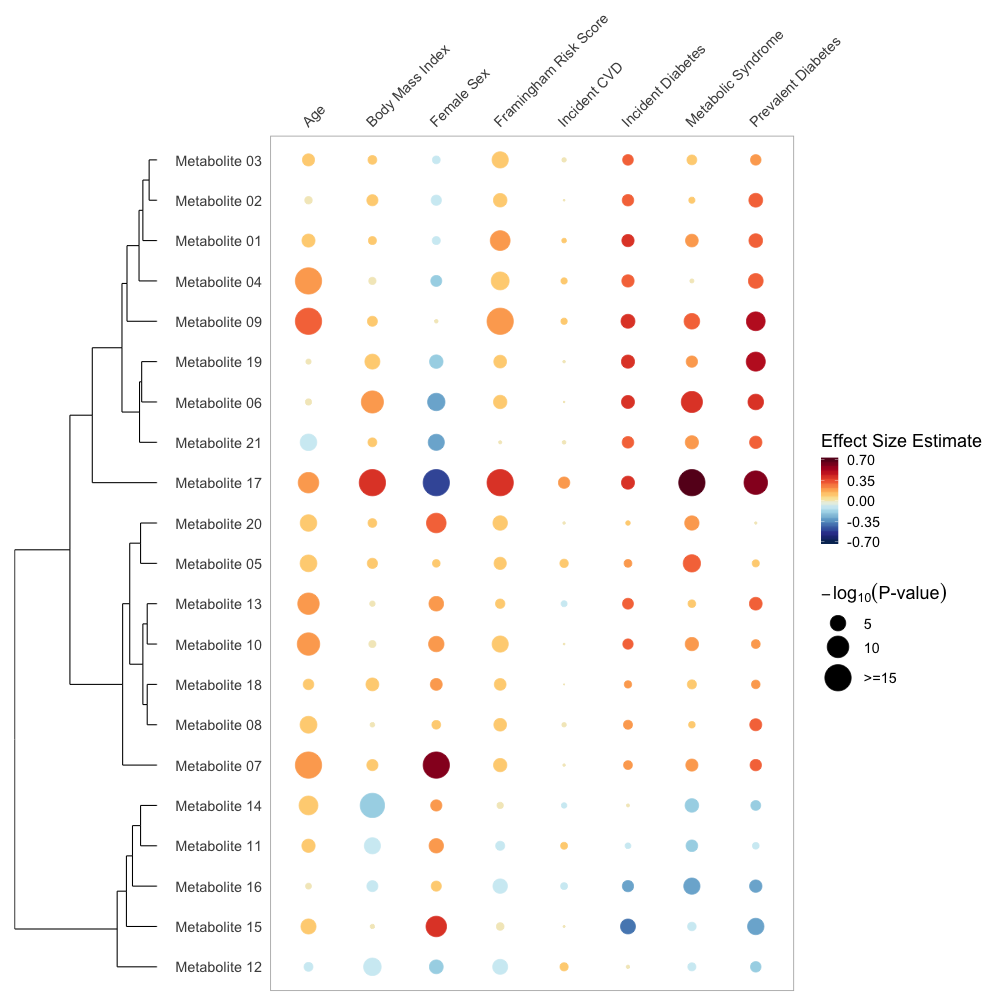

# Rainplots

### Visualizing the results of multiple association analyses



### Table of contents

* [What are rainplots?](#what-are-rainplots)
* [Read the paper](#read-the-paper)
* [What is in this repo?](#what-is-in-this-repo)
* [Using the code](#using-the-code)
* [Questions and feedback](#questions-and-feedback)
* [Citing rainplots](#citing-rainplots)
* [Installing and running on your local machine](#installing-and-running-on-your-local-machine)
  * [Download from GitHub](#download-from-github) 
  * [Setting up the R environment](#setting-up-the-r-environment)

## What are rainplots?

Rainplots are plots that can be used to visualize the results of large association studies commonly performed in 'omics' type fields. One example of such a study is an observational study evaluating the relationship between levels of metabolites in the blood, and traits or health outcomes of interest, such as heart disease and diabetes. Rainplots can simultaneously indicate effect size, directionality, and statistical significance of associations between metabolites and several outcomes of interest at once. This enables visual comparison features of all metabolites examined with a given trait.

## Read the paper

In June 2019, rainplots was published in the open access journal *Metabolites*! Read the paper, *A Single Visualization Technique for Displaying Multiple Metabolite–Phenotype Associations*, [here](https://doi.org/10.3390/metabo9070128)

## What is in this repo?

This repository contains step-by-step tutorials for creating rainplots using the R package `ggplot2`. In addition, `ggplot2` tutorials to create other visualizations discussed in our paper, such as heatmaps, Manhattan plots, volcano plots, and spark-and-scatter plots, are included as well. These tutorials can be found in the [tutorials folder](tutorials). HTML and PDF versions of the tutorials are both available. The RMarkdown files are also availible for interactive use. Code from those tutorials has also been extracted in `.R` documents for ease of use. The `.R` documents can be found in the [scripts folder](scripts).

Tutorials completed:

- [X] Rainplots
- [X] Heatmaps
- [X] Manhattan plots
- [X] Volcano plots
- [] Spark-and-scatter plots
- [] In depth side-by-side plots

## Using the code

We hope you find these tutorials helpful and want to use the code in your next project, paper, or presentation! The code in the repository is available under the [MIT license](LICENSE). The MIT license is a simple and permissive license only requiring preservation of copyright and license notices. This means you're free to use and edit the contents so long as you credit the code creator, Mir Henglin. 

## Questions and Feedback

We'd love to hear your thoughts, feedback and any questions you might have. Currently, the best way to do so is to open an issue. If you are having trouble using any of the code in this repository, open an issue and we will do our best to get in touch with you shortly!

## Citing rainplots

#### MDPI and ACS Style
> Henglin, M.; Niiranen, T.; Watrous, J.D.; Lagerborg, K.A.; Antonelli, J.; Claggett, B.L.; Demosthenes, E.J.; von Jeinsen, B.; Demler, O.; Vasan, R.S.; Larson, M.G.; Jain, M.; Cheng, S. A Single Visualization Technique for Displaying Multiple Metabolite–Phenotype Associations. Metabolites 2019, 9, 128.

#### AMA Style
> Henglin M, Niiranen T, Watrous JD, Lagerborg KA, Antonelli J, Claggett BL, Demosthenes EJ, von Jeinsen B, Demler O, Vasan RS, Larson MG, Jain M, Cheng S. A Single Visualization Technique for Displaying Multiple Metabolite–Phenotype Associations. Metabolites. 2019; 9(7):128.

#### Chicago/Turabian Style
> Henglin, Mir; Niiranen, Teemu; Watrous, Jeramie D.; Lagerborg, Kim A.; Antonelli, Joseph; Claggett, Brian L.; Demosthenes, Emmanuella J.; von Jeinsen, Beatrice; Demler, Olga; Vasan, Ramachandran S.; Larson, Martin G.; Jain, Mohit; Cheng, Susan. 2019. "A Single Visualization Technique for Displaying Multiple Metabolite–Phenotype Associations." Metabolites 9, no. 7: 128.

## Installing and running on your local machine

### Download from GitHub

You can copy of all the code in this repository by [downloading](https://github.com/rainplots/rainplots/archive/master.zip) a copy, or you can [clone the repository](https://help.github.com/articles/cloning-a-repository/) if you're familiar with git and GitHub. If you download the repository, you will first need to unzip it before using it.

### Setting up the R environment

To run the code, you will need to have R installed on your computer. R is free software for statistical computing and graphics, and is widely used for statistical software development and data analysis. Download the appropriate version of R for your operating system [here](https://www.r-project.org/)

In addition, we recommend that you use RStudio when interacting with the repo code. RStudio is a powerful and feature-rich IDE for R programming. You can download the appropriate version of **RStudio Desktop** for your operating system [here](https://www.rstudio.com/products/rstudio/download/). Double-clicking the `rainplots.Rproj` file will automatically open up RStudio and attempt to install all the packages needed to run the code and create the tutorial documents. Otherwise, you can install the packages needed using the line of code below:

```
install.packages(
  'dplyr',
  'tidyr',
  'ggdendro',
  'gridExtra',
  'ggplot2',
  'ggrepel'
)
```

